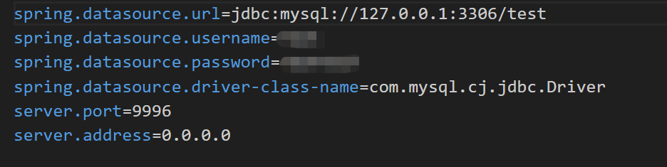
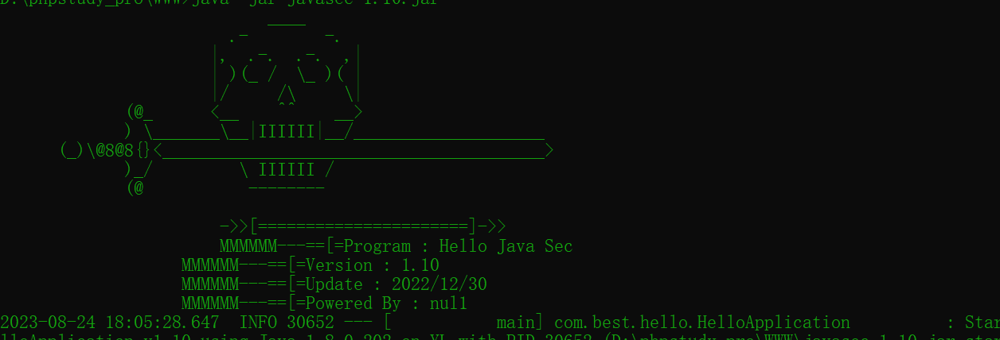

首先我们的需要jdk1.8的环境

参考[win10安装jdk1.8（附国内下载镜像）_jdk1.8镜像_晓之木初的博客-CSDN博客](https://blog.csdn.net/u014454538/article/details/88085316)

下载好之后 我们下载 javasec-1.10.jar

准备就绪后我们需要找到文件

javasec-1.10.jar\BOOT-INF\classes\db.sql

然后我们把它导入到我们的sql数据库中

当然页可以直接复制代码然后去sql里面创建

然后打开同级目录的application.properties 

需要这里对数据库的密码进行配置页和修改

一切完成后 我们输入java -jar javasec-1.10.jar

然后就可以启动 

最后我们去网站访问localhost:端口(默认9996)即可

账号和密码都是admin/admin